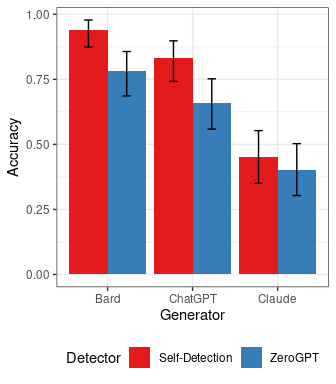
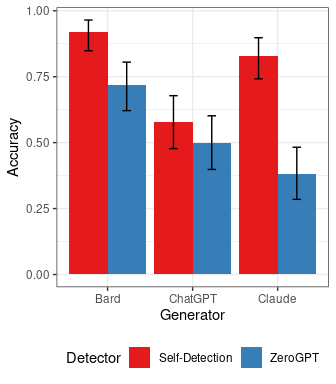
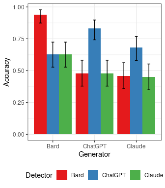

# Self-detection

``` r
library("tidyverse")
```

    ── Attaching core tidyverse packages ──────────────────────── tidyverse 2.0.0 ──
    ✔ dplyr     1.1.4     ✔ readr     2.1.4
    ✔ forcats   1.0.0     ✔ stringr   1.5.0
    ✔ ggplot2   3.4.3     ✔ tibble    3.2.1
    ✔ lubridate 1.9.2     ✔ tidyr     1.3.0
    ✔ purrr     1.0.2     
    ── Conflicts ────────────────────────────────────────── tidyverse_conflicts() ──
    ✖ dplyr::filter() masks stats::filter()
    ✖ dplyr::lag()    masks stats::lag()
    ℹ Use the conflicted package (<http://conflicted.r-lib.org/>) to force all conflicts to become errors

``` r
library("caret")
```

    Loading required package: lattice

    Attaching package: 'caret'

    The following object is masked from 'package:purrr':

        lift

Load the data

``` r
x <- read_csv("AI_vs_Human_Data.csv", col_types = "ffffcfffffffffff")
x
```

    # A tibble: 350 × 9
       Source Model   Paraphrased Topic          Answer ChatGPT Bard  Claude zeroGPT
       <fct>  <fct>   <fct>       <fct>          <chr>  <fct>   <fct> <fct>  <fct>  
     1 AI     ChatGPT No          Global Warming "Glob… AI      Human Human  AI     
     2 AI     ChatGPT No          James Webb Te… "The … AI      Human Human  AI     
     3 AI     ChatGPT No          Artificial In… "Arti… AI      Human Human  AI     
     4 AI     ChatGPT No          Climate Chang… "Clim… AI      Human Human  AI     
     5 AI     ChatGPT No          The Future of… "The … AI      Human Human  AI     
     6 AI     ChatGPT No          Space Explora… "Spac… AI      Human Human  Human  
     7 AI     ChatGPT No          Mental Health… "Ment… AI      Human Human  AI     
     8 AI     ChatGPT No          Human Rights … "In t… AI      Human Human  AI     
     9 AI     ChatGPT No          Impact of Soc… "The … AI      Human Human  AI     
    10 AI     ChatGPT No          Genetic Engin… "Gene… AI      Human Human  AI     
    # ℹ 340 more rows

``` r
x <- x |> mutate(word_count = str_count(Answer, '\\w+'), 
                 char_count = str_count(Answer), 
                 sentence_count = str_count(Answer, "\\. "),
                 newline_count = str_count(Answer, "\n+"))
```

``` r
summary(x)
```

       Source        Model     Paraphrased                               Topic    
     AI   :300   ChatGPT:100   No  :150    Global Warming                   :  7  
     Human: 50   Bard   :100   Yes :150    James Webb Telescope             :  7  
                 Claude :100   NA's: 50    Human Rights in the Digital Age  :  7  
                 None   : 50               Impact of Social Media on Society:  7  
                                           Healthcare Access and Reform     :  7  
                                           Automation and the Future of Work:  7  
                                           (Other)                          :308  
        Answer           ChatGPT       Bard       Claude     zeroGPT   
     Length:350         AI   :132   Human:150   Human:176   AI   :156  
     Class :character   Human:118   AI   :100   AI   : 74   Human:194  
     Mode  :character   NA's :100   NA's :100   NA's :100              
                                                                       
                                                                       
                                                                       
                                                                       
       word_count       char_count   sentence_count   newline_count   
     Min.   :  36.0   Min.   : 276   Min.   : 0.000   Min.   : 0.000  
     1st Qu.: 182.0   1st Qu.:1357   1st Qu.: 6.000   1st Qu.: 0.000  
     Median : 206.0   Median :1509   Median : 8.000   Median : 0.000  
     Mean   : 239.2   Mean   :1641   Mean   : 8.749   Mean   : 3.774  
     3rd Qu.: 245.8   3rd Qu.:1688   3rd Qu.:11.000   3rd Qu.: 8.000  
     Max.   :1247.0   Max.   :7399   Max.   :58.000   Max.   :51.000  
                                                                      

``` r
x |> group_by(Source, Model, Paraphrased) |> count()
```

    # A tibble: 7 × 4
    # Groups:   Source, Model, Paraphrased [7]
      Source Model   Paraphrased     n
      <fct>  <fct>   <fct>       <int>
    1 AI     ChatGPT No             50
    2 AI     ChatGPT Yes            50
    3 AI     Bard    No             50
    4 AI     Bard    Yes            50
    5 AI     Claude  No             50
    6 AI     Claude  Yes            50
    7 Human  None    <NA>           50

``` r
count_summary <- x |> group_by(Source, Model, Paraphrased) |> 
  summarize(`Number of Essays` = n(),
            `Word Count` = mean(word_count), 
      #      `Character Count` = mean(char_count), 
            `Sentence Count` = mean(sentence_count),
            `Words/Sentence` = mean(word_count)/mean(sentence_count),
            `Newline Count` = mean(newline_count))
```

    `summarise()` has grouped output by 'Source', 'Model'. You can override using
    the `.groups` argument.

``` r
count_summary
```

    # A tibble: 7 × 8
    # Groups:   Source, Model [4]
      Source Model   Paraphrased `Number of Essays` `Word Count` `Sentence Count`
      <fct>  <fct>   <fct>                    <int>        <dbl>            <dbl>
    1 AI     ChatGPT No                          50         194.             7.98
    2 AI     ChatGPT Yes                         50         194.             8.1 
    3 AI     Bard    No                          50         292.             6.06
    4 AI     Bard    Yes                         50         251.             5.24
    5 AI     Claude  No                          50         206.            11.8 
    6 AI     Claude  Yes                         50         187.            11.1 
    7 Human  None    <NA>                        50         348.            11.0 
    # ℹ 2 more variables: `Words/Sentence` <dbl>, `Newline Count` <dbl>

``` r
library("xtable")
xtable(count_summary)
```

    % latex table generated in R 4.3.2 by xtable 1.8-4 package
    % Tue Dec 19 11:05:51 2023
    \begin{table}[ht]
    \centering
    \begin{tabular}{rlllrrrrr}
      \hline
     & Source & Model & Paraphrased & Number of Essays & Word Count & Sentence Count & Words/Sentence & Newline Count \\ 
      \hline
    1 & AI & ChatGPT & No &  50 & 193.90 & 7.98 & 24.30 & 0.00 \\ 
      2 & AI & ChatGPT & Yes &  50 & 194.36 & 8.10 & 24.00 & 0.00 \\ 
      3 & AI & Bard & No &  50 & 292.30 & 6.06 & 48.23 & 10.86 \\ 
      4 & AI & Bard & Yes &  50 & 251.48 & 5.24 & 47.99 & 9.32 \\ 
      5 & AI & Claude & No &  50 & 206.38 & 11.76 & 17.55 & 0.00 \\ 
      6 & AI & Claude & Yes &  50 & 187.40 & 11.06 & 16.94 & 0.00 \\ 
      7 & Human & None &  &  50 & 348.26 & 11.04 & 31.55 & 6.24 \\ 
       \hline
    \end{tabular}
    \end{table}

## Self-Detection

``` r
eval <- function(x, generator, paraphrased, detector) {
  x |> filter(Source == "Human" | Model == generator & Paraphrased == paraphrased) -> x2
  cm <- confusionMatrix(reference = relevel(x2$Source, ref= "Human"), 
                        data = relevel(x2[[detector]], ref = "Human"), positive = "AI")
  data.frame(Generator = generator, Paraphrased = paraphrased,  Detector = detector,
             rbind(cm$overall), rbind(cm$byClass))
}

res <- rbind(
  eval(x, generator = "ChatGPT", paraphrased = "No", detector = "ChatGPT"),
  eval(x, generator = "ChatGPT", paraphrased = "No", detector = "zeroGPT"),
  eval(x, generator = "ChatGPT", paraphrased = "Yes", detector = "ChatGPT"),
  eval(x, generator = "ChatGPT", paraphrased = "Yes", detector = "zeroGPT"),
  
  eval(x, generator = "Bard", paraphrased = "No", detector = "Bard"),
  eval(x, generator = "Bard", paraphrased = "No", detector = "zeroGPT"),
  eval(x, generator = "Bard", paraphrased = "Yes", detector = "Bard"),
  eval(x, generator = "Bard", paraphrased = "Yes", detector = "zeroGPT"),
  
  eval(x, generator = "Claude", paraphrased = "No", detector = "Claude"),
  eval(x, generator = "Claude", paraphrased = "No", detector = "zeroGPT"),
  eval(x, generator = "Claude", paraphrased = "Yes", detector = "Claude"),
  eval(x, generator = "Claude", paraphrased = "Yes", detector = "zeroGPT")
)

res |> mutate(Detector = ifelse(Detector != "zeroGPT", "Self-Detection", "ZeroGPT")) -> res 

res
```

       Generator Paraphrased       Detector Accuracy Kappa AccuracyLower
    1    ChatGPT          No Self-Detection     0.83  0.66     0.7418246
    2    ChatGPT          No        ZeroGPT     0.66  0.32     0.5584667
    3    ChatGPT         Yes Self-Detection     0.58  0.16     0.4771192
    4    ChatGPT         Yes        ZeroGPT     0.50  0.00     0.3983211
    5       Bard          No Self-Detection     0.94  0.88     0.8739701
    6       Bard          No        ZeroGPT     0.78  0.56     0.6860803
    7       Bard         Yes Self-Detection     0.92  0.84     0.8484424
    8       Bard         Yes        ZeroGPT     0.72  0.44     0.6213330
    9     Claude          No Self-Detection     0.45 -0.10     0.3503202
    10    Claude          No        ZeroGPT     0.40 -0.20     0.3032948
    11    Claude         Yes Self-Detection     0.83  0.66     0.7418246
    12    Claude         Yes        ZeroGPT     0.38 -0.24     0.2847675
       AccuracyUpper AccuracyNull AccuracyPValue McnemarPValue Sensitivity
    1      0.8977351          0.5   6.548999e-12  1.456101e-01        0.90
    2      0.7517765          0.5   8.949652e-04  8.638317e-01        0.64
    3      0.6780145          0.5   6.660531e-02  8.711913e-03        0.40
    4      0.6016789          0.5   5.397946e-01  1.620954e-02        0.32
    5      0.9776651          0.5   1.002980e-21  6.830914e-01        0.96
    6      0.8566964          0.5   7.952664e-09  5.500883e-02        0.88
    7      0.9648284          0.5   1.604282e-19  1.000000e+00        0.92
    8      0.8052064          0.5   6.289575e-06  5.707504e-01        0.76
    9      0.5527198          0.5   8.643735e-01  6.906029e-08        0.04
    10     0.5027908          0.5   9.823999e-01  4.908786e-04        0.12
    11     0.8977351          0.5   6.548999e-12  6.276258e-01        0.80
    12     0.4825393          0.5   9.939835e-01  2.305018e-04        0.08
       Specificity Pos.Pred.Value Neg.Pred.Value Precision Recall         F1
    1         0.76      0.7894737      0.8837209 0.7894737   0.90 0.84112150
    2         0.68      0.6666667      0.6538462 0.6666667   0.64 0.65306122
    3         0.76      0.6250000      0.5588235 0.6250000   0.40 0.48780488
    4         0.68      0.5000000      0.5000000 0.5000000   0.32 0.39024390
    5         0.92      0.9230769      0.9583333 0.9230769   0.96 0.94117647
    6         0.68      0.7333333      0.8500000 0.7333333   0.88 0.80000000
    7         0.92      0.9200000      0.9200000 0.9200000   0.92 0.92000000
    8         0.68      0.7037037      0.7391304 0.7037037   0.76 0.73076923
    9         0.86      0.2222222      0.4725275 0.2222222   0.04 0.06779661
    10        0.68      0.2727273      0.4358974 0.2727273   0.12 0.16666667
    11        0.86      0.8510638      0.8113208 0.8510638   0.80 0.82474227
    12        0.68      0.2000000      0.4250000 0.2000000   0.08 0.11428571
       Prevalence Detection.Rate Detection.Prevalence Balanced.Accuracy
    1         0.5           0.45                 0.57              0.83
    2         0.5           0.32                 0.48              0.66
    3         0.5           0.20                 0.32              0.58
    4         0.5           0.16                 0.32              0.50
    5         0.5           0.48                 0.52              0.94
    6         0.5           0.44                 0.60              0.78
    7         0.5           0.46                 0.50              0.92
    8         0.5           0.38                 0.54              0.72
    9         0.5           0.02                 0.09              0.45
    10        0.5           0.06                 0.22              0.40
    11        0.5           0.40                 0.47              0.83
    12        0.5           0.04                 0.20              0.38

``` r
res |> mutate(Accuracy =  round(Accuracy, 2),
              Precision =  round(Precision, 2),
              `Detection Rate` =  round(Recall, 2),
              `PValue (Accuracy > .5)` = round(AccuracyPValue,2)
              )  |> 
  arrange(Paraphrased) |>
  select(Generator, Paraphrased, Detector, Accuracy, `PValue (Accuracy > .5)`, `Detection Rate`, Precision) -> res2

res2
```

       Generator Paraphrased       Detector Accuracy PValue (Accuracy > .5)
    1    ChatGPT          No Self-Detection     0.83                   0.00
    2    ChatGPT          No        ZeroGPT     0.66                   0.00
    3       Bard          No Self-Detection     0.94                   0.00
    4       Bard          No        ZeroGPT     0.78                   0.00
    5     Claude          No Self-Detection     0.45                   0.86
    6     Claude          No        ZeroGPT     0.40                   0.98
    7    ChatGPT         Yes Self-Detection     0.58                   0.07
    8    ChatGPT         Yes        ZeroGPT     0.50                   0.54
    9       Bard         Yes Self-Detection     0.92                   0.00
    10      Bard         Yes        ZeroGPT     0.72                   0.00
    11    Claude         Yes Self-Detection     0.83                   0.00
    12    Claude         Yes        ZeroGPT     0.38                   0.99
       Detection Rate Precision
    1            0.90      0.79
    2            0.64      0.67
    3            0.96      0.92
    4            0.88      0.73
    5            0.04      0.22
    6            0.12      0.27
    7            0.40      0.62
    8            0.32      0.50
    9            0.92      0.92
    10           0.76      0.70
    11           0.80      0.85
    12           0.08      0.20

``` r
library("xtable")
xtable(res2)
```

    % latex table generated in R 4.3.2 by xtable 1.8-4 package
    % Tue Dec 19 11:05:51 2023
    \begin{table}[ht]
    \centering
    \begin{tabular}{rlllrrrr}
      \hline
     & Generator & Paraphrased & Detector & Accuracy & PValue (Accuracy $>$ .5) & Detection Rate & Precision \\ 
      \hline
    1 & ChatGPT & No & Self-Detection & 0.83 & 0.00 & 0.90 & 0.79 \\ 
      2 & ChatGPT & No & ZeroGPT & 0.66 & 0.00 & 0.64 & 0.67 \\ 
      3 & Bard & No & Self-Detection & 0.94 & 0.00 & 0.96 & 0.92 \\ 
      4 & Bard & No & ZeroGPT & 0.78 & 0.00 & 0.88 & 0.73 \\ 
      5 & Claude & No & Self-Detection & 0.45 & 0.86 & 0.04 & 0.22 \\ 
      6 & Claude & No & ZeroGPT & 0.40 & 0.98 & 0.12 & 0.27 \\ 
      7 & ChatGPT & Yes & Self-Detection & 0.58 & 0.07 & 0.40 & 0.62 \\ 
      8 & ChatGPT & Yes & ZeroGPT & 0.50 & 0.54 & 0.32 & 0.50 \\ 
      9 & Bard & Yes & Self-Detection & 0.92 & 0.00 & 0.92 & 0.92 \\ 
      10 & Bard & Yes & ZeroGPT & 0.72 & 0.00 & 0.76 & 0.70 \\ 
      11 & Claude & Yes & Self-Detection & 0.83 & 0.00 & 0.80 & 0.85 \\ 
      12 & Claude & Yes & ZeroGPT & 0.38 & 0.99 & 0.08 & 0.20 \\ 
       \hline
    \end{tabular}
    \end{table}

``` r
ggplot(res |> filter(Paraphrased == "No"), mapping = aes(x=Generator, y=Accuracy, fill = Detector)) +
    geom_bar(stat="identity", position = "dodge") +
    geom_errorbar(aes(ymin=AccuracyLower, ymax=AccuracyUpper), width = .2, position = position_dodge(.9)) +
  scale_fill_brewer(palette = "Set1") + theme_bw() +
  theme(legend.position="bottom")
```



``` r
ggplot(res |> filter(Paraphrased == "Yes"), mapping = aes(x=Generator, y=Accuracy, fill = Detector)) +
    geom_bar(stat="identity", position = "dodge") +
    geom_errorbar(aes(ymin=AccuracyLower, ymax=AccuracyUpper), width = .2, position = position_dodge(.9)) +
  scale_fill_brewer(palette = "Set1") + theme_bw() +
  theme(legend.position="bottom")
```



## Detection by other Models

``` r
res_cross <- rbind(
  eval(x, generator = "ChatGPT", paraphrased = "No", detector = "ChatGPT"),
  eval(x, generator = "ChatGPT", paraphrased = "No", detector = "Bard"),
  eval(x, generator = "ChatGPT", paraphrased = "No", detector = "Claude"),

  eval(x, generator = "Bard", paraphrased = "No", detector = "ChatGPT"),
  eval(x, generator = "Bard", paraphrased = "No", detector = "Bard"),
  eval(x, generator = "Bard", paraphrased = "No", detector = "Claude"),
  
  eval(x, generator = "Claude", paraphrased = "No", detector = "ChatGPT"),
  eval(x, generator = "Claude", paraphrased = "No", detector = "Bard"),
  eval(x, generator = "Claude", paraphrased = "No", detector = "Claude")
)

#res |> mutate(Detector = ifelse(Detector != "zeroGPT", "Self-Detection", "ZeroGPT")) -> res 

res_cross
```

      Generator Paraphrased Detector Accuracy Kappa AccuracyLower AccuracyUpper
    1   ChatGPT          No  ChatGPT     0.83  0.66     0.7418246     0.8977351
    2   ChatGPT          No     Bard     0.48 -0.04     0.3790055     0.5822102
    3   ChatGPT          No   Claude     0.48 -0.04     0.3790055     0.5822102
    4      Bard          No  ChatGPT     0.63  0.26     0.5276484     0.7244334
    5      Bard          No     Bard     0.94  0.88     0.8739701     0.9776651
    6      Bard          No   Claude     0.63  0.26     0.5276484     0.7244334
    7    Claude          No  ChatGPT     0.68  0.36     0.5792331     0.7697801
    8    Claude          No     Bard     0.46 -0.08     0.3598434     0.5625884
    9    Claude          No   Claude     0.45 -0.10     0.3503202     0.5527198
      AccuracyNull AccuracyPValue McnemarPValue Sensitivity Specificity
    1          0.5   6.548999e-12  1.456101e-01        0.90        0.76
    2          0.5   6.913503e-01  2.476073e-09        0.04        0.92
    3          0.5   6.913503e-01  2.882424e-07        0.10        0.86
    4          0.5   6.016488e-03  4.851974e-02        0.50        0.76
    5          0.5   1.002980e-21  6.830914e-01        0.96        0.92
    6          0.5   6.016488e-03  2.982932e-04        0.40        0.86
    7          0.5   2.043886e-04  2.159249e-01        0.60        0.76
    8          0.5   8.158992e-01  9.141298e-10        0.00        0.92
    9          0.5   8.643735e-01  6.906029e-08        0.04        0.86
      Pos.Pred.Value Neg.Pred.Value Precision Recall         F1 Prevalence
    1      0.7894737      0.8837209 0.7894737   0.90 0.84112150        0.5
    2      0.3333333      0.4893617 0.3333333   0.04 0.07142857        0.5
    3      0.4166667      0.4886364 0.4166667   0.10 0.16129032        0.5
    4      0.6756757      0.6031746 0.6756757   0.50 0.57471264        0.5
    5      0.9230769      0.9583333 0.9230769   0.96 0.94117647        0.5
    6      0.7407407      0.5890411 0.7407407   0.40 0.51948052        0.5
    7      0.7142857      0.6551724 0.7142857   0.60 0.65217391        0.5
    8      0.0000000      0.4791667 0.0000000   0.00        NaN        0.5
    9      0.2222222      0.4725275 0.2222222   0.04 0.06779661        0.5
      Detection.Rate Detection.Prevalence Balanced.Accuracy
    1           0.45                 0.57              0.83
    2           0.02                 0.06              0.48
    3           0.05                 0.12              0.48
    4           0.25                 0.37              0.63
    5           0.48                 0.52              0.94
    6           0.20                 0.27              0.63
    7           0.30                 0.42              0.68
    8           0.00                 0.04              0.46
    9           0.02                 0.09              0.45

``` r
res_cross |> mutate(Accuracy =  round(Accuracy, 2),
              Precision =  round(Precision, 2),
              `Detection Rate` =  round(Recall, 2),
              `PValue (Accuracy > .5)` = round(AccuracyPValue,2)
              )  |> 
  select(Generator, Detector, Accuracy, `PValue (Accuracy > .5)`, `Detection Rate`, Precision) -> res2

res2
```

      Generator Detector Accuracy PValue (Accuracy > .5) Detection Rate Precision
    1   ChatGPT  ChatGPT     0.83                   0.00           0.90      0.79
    2   ChatGPT     Bard     0.48                   0.69           0.04      0.33
    3   ChatGPT   Claude     0.48                   0.69           0.10      0.42
    4      Bard  ChatGPT     0.63                   0.01           0.50      0.68
    5      Bard     Bard     0.94                   0.00           0.96      0.92
    6      Bard   Claude     0.63                   0.01           0.40      0.74
    7    Claude  ChatGPT     0.68                   0.00           0.60      0.71
    8    Claude     Bard     0.46                   0.82           0.00      0.00
    9    Claude   Claude     0.45                   0.86           0.04      0.22

``` r
library("xtable")
xtable(res2)
```

    % latex table generated in R 4.3.2 by xtable 1.8-4 package
    % Tue Dec 19 11:05:52 2023
    \begin{table}[ht]
    \centering
    \begin{tabular}{rllrrrr}
      \hline
     & Generator & Detector & Accuracy & PValue (Accuracy $>$ .5) & Detection Rate & Precision \\ 
      \hline
    1 & ChatGPT & ChatGPT & 0.83 & 0.00 & 0.90 & 0.79 \\ 
      2 & ChatGPT & Bard & 0.48 & 0.69 & 0.04 & 0.33 \\ 
      3 & ChatGPT & Claude & 0.48 & 0.69 & 0.10 & 0.42 \\ 
      4 & Bard & ChatGPT & 0.63 & 0.01 & 0.50 & 0.68 \\ 
      5 & Bard & Bard & 0.94 & 0.00 & 0.96 & 0.92 \\ 
      6 & Bard & Claude & 0.63 & 0.01 & 0.40 & 0.74 \\ 
      7 & Claude & ChatGPT & 0.68 & 0.00 & 0.60 & 0.71 \\ 
      8 & Claude & Bard & 0.46 & 0.82 & 0.00 & 0.00 \\ 
      9 & Claude & Claude & 0.45 & 0.86 & 0.04 & 0.22 \\ 
       \hline
    \end{tabular}
    \end{table}

``` r
ggplot(res_cross, mapping = aes(x=Generator, y=Accuracy, fill = Detector)) +
    geom_bar(stat="identity", position = "dodge") +
    geom_errorbar(aes(ymin=AccuracyLower, ymax=AccuracyUpper), width = .2, position = position_dodge(.9)) +
  scale_fill_brewer(palette = "Set1") + theme_bw() +
  theme(legend.position="bottom")
```


